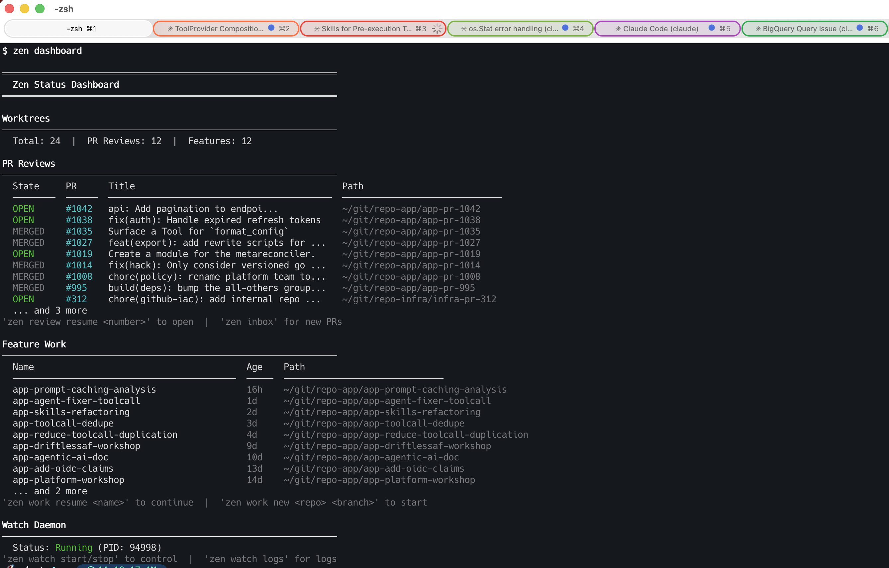

# zen

> Review PRs and ship features in parallel — each one in its own Claude-ready worktree.

You're reviewing more PRs and starting more features than ever, because [Claude Code](https://docs.anthropic.com/en/docs/claude-code) makes each one faster. But your IDE and your shell still want one branch at a time. Zen fixes that mismatch.

For every PR in your review queue and every feature you're working on, zen creates a dedicated git worktree with Claude pre-armed: PR context injected as `CLAUDE.local.md` (never touching the repo's own `CLAUDE.md`), the right slash command installed, terminal tab opened on demand. A background daemon watches GitHub, prepares review worktrees silently as PRs come in, and removes them a few days after merge. Open a tab when you're ready — everything is already set up.



## Table of contents

- [Quick start](#quick-start)
- [What needs your attention?](#what-needs-your-attention)
- [Review a PR](#review-a-pr)
- [Work on a feature](#work-on-a-feature)
- [Where am I?](#where-am-i)
- [How it works](#how-it-works)
- [Configuration](#configuration)
- [MCP server](#mcp-server)
- [Context injection](#context-injection)
- [Prerequisites](#prerequisites)
- [Building](#building)

## Quick start

```bash
git clone https://github.com/mgreau/zen.git && cd zen
make build && mv zen ~/bin/       # or anywhere on your PATH

gh auth login
zen setup                          # interactive: repos, authors, daemon settings
zen watch start                    # background daemon polls GitHub for PRs
zen inbox                          # see what needs your attention
```

When a PR shows up in your inbox, `zen review <number>` opens that PR in a new terminal tab with Claude pre-armed and the PR context loaded. See [Prerequisites](#prerequisites) for what to install first.

## What needs your attention?

`zen inbox` is your daily triage. Three classes of PRs land here:

- **Reviews waiting on you** — PRs from configured authors, plus any explicit review requests.
- **Your own approved-but-unmerged PRs** — signed off, ready to land.
- **Open PRs touching paths you watch** — for staying aware of areas you care about.

```bash
zen inbox                        # everything, filtered by configured authors
zen inbox --all                  # from all authors
zen inbox --path pkg/sts         # PRs touching specific paths
zen inbox --repo other-repo      # different repo
```

Example output:

```
───────────────────────────────────────────────────────────────
  Legend  W = Worktree
       * = local worktree exists
       zen review resume <number> to open  |  zen review <number> to create

2 Pending PR Reviews — app
Authors: alice bob charlie dave
═══════════════════════════════════════════════════════════════

  PR      Author                Title                                       Link
  ──────  ────────────────────  ──────────────────────────────────────────  ────────────────────────
  #1042   alice                 api: Add pagination to ListUsers endpoi...  https://github.com/acme/app/pull/1042
  #1038   bob                   fix(auth): Handle expired refresh tokens    https://github.com/acme/app/pull/1038
```

## Review a PR

`zen review 42` fetches the PR branch, creates a worktree, injects `CLAUDE.local.md`, installs the `/review-pr` slash command, and opens a terminal tab with Claude. When `--repo` is omitted, zen auto-detects by querying GitHub — if the PR number exists in multiple configured repos, it prefers the one where you're a requested reviewer or asks you to choose.

```bash
zen review 42                    # create worktree + open terminal tab
zen review 42 --repo other       # specify repo explicitly
zen review 42 --no-terminal      # create worktree only, print command
zen review 42 --model opus       # pick Claude model (sonnet, opus, haiku)
zen review resume 42             # open existing worktree in new terminal tab
zen review resume 42 --list      # list available sessions
zen review resume 42 --session 2 # resume specific session
zen review delete 42             # remove a PR review worktree (with confirmation)
```

If the worktree already exists, `zen review` resumes it; otherwise `zen review resume` offers to create one.

## Work on a feature

Same isolation model, your own branches. `zen work new` and `zen work resume` open the worktree in a new terminal tab by default; pass `--no-terminal` to skip.

```bash
zen work                                       # list feature worktrees
zen work new <repo> <branch>                   # create new feature worktree
zen work new app my-feature "initial prompt"   # with Claude prompt
zen work new app my-feature --model opus       # pick Claude model
zen work resume <name>                         # resume a feature session in new tab
zen work resume <name> --model opus            # resume with a specific model
zen work delete <name>                         # delete worktree (cleans Claude sessions too)
```

Feature branches are prefixed by `branch_prefix` from config — see [docs/configuration.md](docs/configuration.md).

## Where am I?

Different lenses on what you're doing across worktrees.

### `zen who-am-i` — your work summary

```bash
zen who-am-i                         # all repos, last 7 days
zen who-am-i -r app -p 30d           # specific repo, last 30 days
zen who-am-i --merged                # only merged & deployed PRs with descriptions
zen who-am-i --merged -r app -p 7d   # merged PRs in app, last 7 days
```

Three sections: **Merged & Deployed**, **In Progress**, **PR Reviews**. Period formats: `1d`, `7d`, `30d`, `2w`, `1m`. Also exposed via MCP as `zen_who_am_i`.

### `zen status` — overview of all active work

```bash
zen status                       # alias: zen dashboard
```

Worktree counts, PR reviews (with remote state and cleanup ETA), feature work, and daemon state.

### `zen reviews` — your recent reviews

```bash
zen reviews                      # PR reviews from past 7 days
zen reviews --days 30            # past 30 days
```

### `zen search` — find a worktree

```bash
zen search 42                    # by PR number
zen search oidc                  # by branch/name
zen search --type pr <term>      # filter: pr, feature
```

### `zen agent status` — Claude sessions

```bash
zen agent status                 # all worktrees
zen agent status --running       # only running sessions
zen agent status --full          # full token usage scan (slower)
```

Session ID, model, token usage, and last activity per worktree.

## How it works

```
  GitHub ──── zen watch ──── Worktrees Ready ──── You Review ──────── Cleanup
   PRs         (daemon)       (silent prep)       (zen review resume)  (automatic)
```

Two loops keep zen useful.

The **automated loop** is the daemon. It polls GitHub for PRs from configured authors, creates a worktree per PR with context pre-loaded, sends a macOS notification when ready, and removes worktrees a few days after merge. Each step is idempotent and retries on failure. The daemon does **not** open terminal tabs — worktrees are prepared silently.

The **manual loop** is yours: check what needs your attention, open a worktree in a new tab with Claude, do the work.

```bash
zen watch start                  # start background daemon
zen watch stop                   # stop daemon
zen watch status                 # show daemon status + last check
zen watch logs                   # tail daemon log output
zen watch logs search 42         # search logs for a PR, worktree, or keyword
```

Manual cleanup, in case you want it (the daemon handles merged PRs automatically, 5+ days after merge):

```bash
zen cleanup                      # find stale worktrees
zen cleanup --days 14            # custom age threshold
zen cleanup --delete             # interactive deletion
```

For the internal design (workqueues, reconcilers, retry behaviour) see [docs/architecture.md](docs/architecture.md).

## Configuration

Minimal `~/.zen/config.yaml`:

```yaml
repos:
  app:
    full_name: octo-sts/app
    base_path: ~/git/repo-octo-sts-app

authors:
  - mattmoor
  - wlynch
```

`zen setup` walks you through this interactively. The daemon hot-reloads config on every poll tick — no restart needed.

Full reference (poll intervals, terminal selection, branch prefix, multi-repo disambiguation, state file paths) in [docs/configuration.md](docs/configuration.md).

## MCP server

```
zen mcp serve
```

Speaks Model Context Protocol over stdio so a running Claude session can call zen tools directly: list worktrees, check inbox, fetch PR details, open reviews. Register once:

```
claude mcp add --scope user zen -- zen mcp serve
```

Tool inventory and usage in [docs/mcp.md](docs/mcp.md).

## Context injection

The daemon writes a `CLAUDE.local.md` file into each PR worktree with the PR title, author, changed files, and review instructions. The repo's own `CLAUDE.md` is never touched — there's no risk of accidental commits. To refresh manually:

```
zen context inject <path> --pr 42 --repo app
```

## Prerequisites

| Requirement | Why |
|-------------|-----|
| **macOS** | iTerm2/Ghostty tab management and notifications use AppleScript |
| **Git** | Worktree creation, fetching PR branches, cleanup |
| **[GitHub CLI](https://cli.github.com/) (`gh`)** | Authentication and GitHub API access — must be logged in (`gh auth login`) |
| **[iTerm2](https://iterm2.com/)** or **[Ghostty](https://ghostty.io/)** | Opens review/work sessions in new tabs. Ghostty needs accessibility permissions for tab creation; falls back to new windows otherwise (see [docs/configuration.md](docs/configuration.md#terminal)) |
| **[Claude Code](https://docs.anthropic.com/en/docs/claude-code) (`claude`)** | AI-assisted PR reviews and coding sessions |
| **Go 1.24+** | Building from source |

## Building

```
make build
```

See [CONTRIBUTING.md](CONTRIBUTING.md) for testing and architecture pointers.

## Why "zen"?

I was watching *The Last Dance* when naming this tool. Phil Jackson — the "Zen Master" — and his coaching philosophy resonated: orchestrate the system, trust the players, stay calm while everything moves around you. That's what this tool does: silently prepares worktrees, injects context, cleans up after itself, and lets you focus on the actual review when you're ready.
